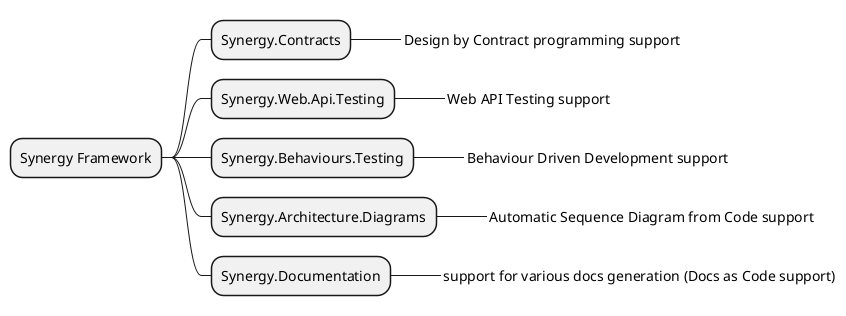

# synergy.framework

[//]: # (TODO Actualize this file)

<!--

-->
 <!-- ← Generated image link. Do NOT modify it manually. -->

[Design by contract programming](https://github.com/synergy-software/synergy.framework/wiki/Contracts)

[Architecture Diagrams  as Code](Architecture/README.md)

[Docs As Code](Documentation/README.md)

